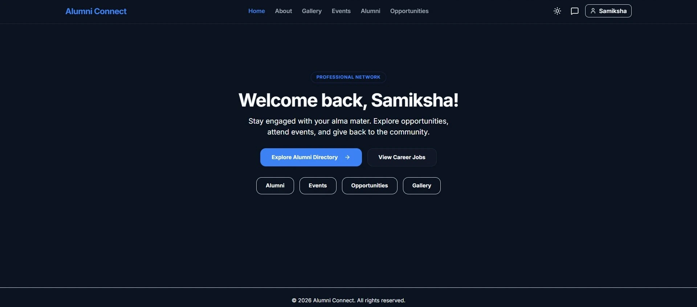
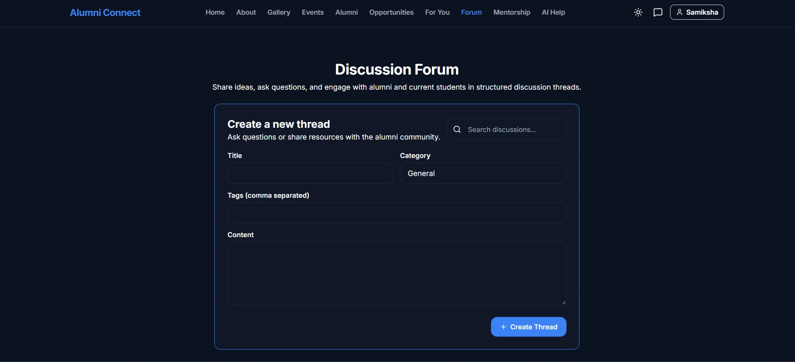

# Alumni Connect

A full-stack alumni interaction platform built to strengthen connections between alumni and current students.

## 🔗 Links

- 🚀 **Live Demo**: [https://alumni-connect-frontendd.vercel.app](https://alumni-connect-frontendd.vercel.app)
- 💻 **GitHub Repository**: [https://github.com/Samiksha-Lone/alumni-connect](https://github.com/Samiksha-Lone/alumni-connect)

## Problem Statement

Technical Education Department institutions need a centralized alumni-student engagement platform to:

- store and update alumni records including contact details, specialization, career paths, and achievements
- provide structured student access to alumni mentorship, career guidance, and networking
- offer motivation through alumni role models and real-world insights
- build a supportive network for lifelong professional collaboration

This project addresses these challenges by providing a centralized platform for alumni engagement, event participation, job opportunities, and intelligent networking.

## 🧩 Problem–Solution Mapping

| Problem | Solution in Alumni Connect |
|--------|--------|
| Lack of centralized alumni data | MongoDB-based alumni directory and profile system |
| Limited student-alumni interaction | Real-time chat, discussion forums, and mentorship network |
| Lack of career guidance | Job board, mentorship matching, and alumni insights |
| Low engagement | Events, webinars, and community-driven discussions |
| Risk of fake profiles and misuse | Authentication, verification system, fraud scoring, and moderation |
| Need for intelligent networking | Weighted matching algorithm and AI-assisted communication tools |

## What is implemented

Alumni Connect currently delivers key platform capabilities:

- **Centralized alumni/student database** with role-based user profiles
- **Profile management** including career and education details, contact info, and resume uploads
- **Alumni directory** with search access to alumni records
- **Real-time chat** using Socket.IO
- **Event management** with event creation and RSVP support
- **Job board** for career opportunity listings
- **Discussion forum** with thread creation and community comments
- **Mentorship network** with alumni mentor search, requests, and mentorship matching
- **Content moderation** for discussion posts and mentorship requests with flagging and content filtering
- 🛡️ **Authenticated profile verification** with fake-profile scoring and admin verification workflow
- **Weighted matching algorithm** that suggests relevant alumni connections based on skills, courses, and career paths
- **AI-powered chatbot assistant** (OpenAI/Ollama) for user guidance and platform help
- **AI-powered icebreaker suggestions** (OpenAI/Ollama) to help users start conversations
- **Role-based authentication** for Student, Alumni, and Admin

## Solution Overview

The application focuses on building a centralized engagement platform where alumni and students can:

- connect through profiles and direct messaging
- participate in events and webinars
- explore placement opportunities through jobs
- build an alumni-student network
- use AI suggestions to improve networking conversations

The platform ensures secure, scalable, and intelligent alumni-student interaction through real-time communication, verification systems, and algorithm-driven recommendations.

## ⭐ Project Highlights

- Real-time chat with Socket.IO
- Role-based authentication and JWT security
- REST APIs with Node.js and Express
- Weighted matching algorithm for alumni recommendations (skill-based, course-based, verification-aware)
- AI-powered features using OpenAI API and Ollama (chatbot, icebreaker generation)
- Responsive UI with React and Tailwind CSS
- Resume upload and profile management

## 🚀 Features

- 🔐 Authentication for Student, Alumni, and Admin
- 👤 Profile management with education and career details
- 👥 Alumni directory with search
- 📊 Weighted matching algorithm for alumni recommendations
- 💬 Real-time messaging
- 🗣️ Discussion forum with thread and comment support
- 🤝 Mentorship network with mentor search and requests
- 🛡️ Profile verification and fraud screening support
- 🧹 Content moderation for forum posts and mentorship requests
- 📅 Event creation and RSVP
- 💼 Job posting and job board
- 🖼️ Gallery uploads
- 🤖 AI-powered chatbot assistant and icebreaker suggestions

## 📸 Screenshots





## 🛠️ Tech Stack

- **Frontend**: React, Vite, Tailwind CSS
- **Backend**: Node.js, Express.js
- **Database**: MongoDB Atlas
- **Real-time**: Socket.IO
- **Authentication**: JWT, bcrypt
- **AI**: Ollama (development) / OpenAI (production)

## ⚙️ Installation / Setup

1. **Clone the repository**
   ```bash
   git clone https://github.com/Samiksha-Lone/alumni-connect.git
   cd alumni-connect
   ```

2. **Install dependencies**
   ```bash
   # Backend
   cd backend
   npm install

   # Frontend
   cd ../frontend
   npm install
   ```

3. **Set up environment variables**
   - Copy `backend/.env.example` to `backend/.env`
   - Add your MongoDB URI and JWT secret

4. **Run the application**
   ```bash
   # Backend (Terminal 1)
   cd backend
   npm run dev

   # Frontend (Terminal 2)
   cd frontend
   npm run dev
   ```

## 🎯 Key Learnings

- Built a comprehensive full-stack MERN platform with real-time functionality
- Implemented real-time communication with Socket.IO and WebSocket authentication
- Designed role-based access control (Student, Alumni, Admin) with JWT security
- Developed weighted matching algorithm for intelligent mentorship and alumni connection suggestions
- Integrated LLM APIs (OpenAI, Ollama) for chatbot and icebreaker generation
- Created content moderation and fraud-detection systems with scoring algorithms
- Built discussion forums with nested comments and threading
- Implemented complex data relationships (users, mentorships, forum threads, events, jobs, messages)
- Designed responsive UX with real-time updates and live chat notifications
- Implemented file uploads (resumes, gallery images) with secure storage

## 🚀 Future Improvements

- Expand discussion moderation with structured workflows and forum administration tools
- Enhance mentorship matching algorithm with personality and learning style compatibility
- Improve fake-profile detection with additional verification methods (email, phone, institutional email)
- Add AI-powered chatbot onboarding wizard for first-time users
- Add email notifications for events, mentorship updates, and important messages
- Implement advanced search with filters for location, industry, graduation year, and skills
- Build admin analytics dashboard with community growth and engagement insights

## 📬 Contact

**Samiksha Balaji Lone**  
📧 samikshalone2@gmail.com  
🔗 [LinkedIn](https://linkedin.com/in/samiksha-lone) | [Portfolio](https://samiksha-lone.vercel.app/)

## License

This project is licensed under the MIT License - see the LICENSE file for details.

## Credit

If you use, fork, or modify this project, please provide proper attribution to the original author:

Name: Samiksha Lone  
GitHub: https://github.com/Samiksha-Lone

Attribution helps acknowledge the original work and supports the open-source community.