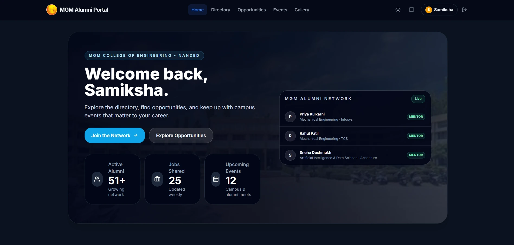
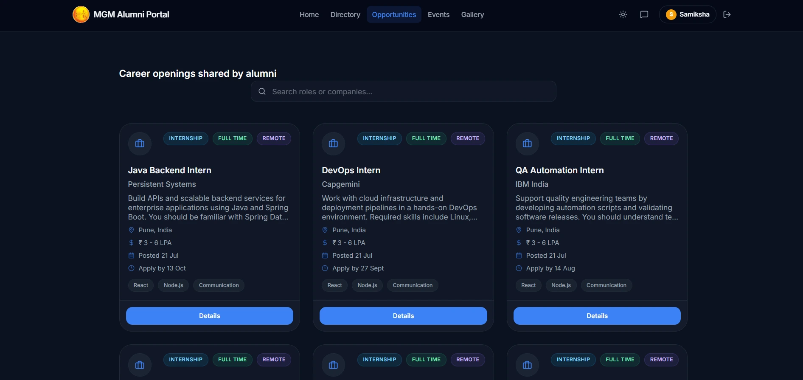
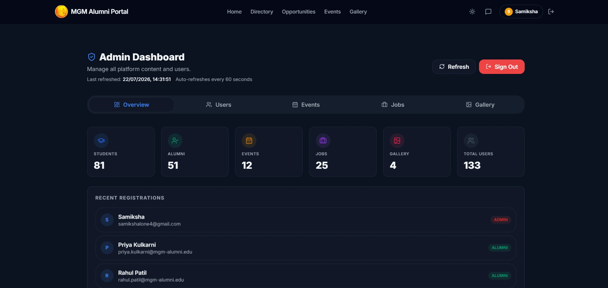

# Alumni Connect — Student and Alumni Networking Platform

> A full-stack Node + React application built to strengthen connections between alumni and current students through mentorship and opportunities.

## 🔗 Links
- **Live Demo**: [https://alumni-connect-frontendd.vercel.app](https://alumni-connect-frontendd.vercel.app)
- **GitHub Repository**: [https://github.com/Samiksha-Lone/alumni-connect](https://github.com/Samiksha-Lone/alumni-connect)

## Overview

Alumni Connect is a centralized platform built to bridge the gap between educational institutions, current students, and alumni. It enables networking, mentorship, career guidance, and campus engagement through a polished full-stack portal.

## Problem Statement

- **Fragmented communication**: Students and alumni lack a single place to connect, share updates, and support careers.
- **Limited mentorship access**: Learners struggle to find structured guidance from experienced alumni in their field.
- **Outdated alumni records**: Institutions struggle to keep alumni profiles current and useful for networking.

## Solution

Alumni Connect solves these challenges with a centralized directory, real-time chat, a job board, and event management. Students can discover mentorship, apply to roles, register for campus events, and stay engaged while admins manage users, content, and gallery updates from a single dashboard.

## Key Features

- 🔐 **Role-Based Authentication** — Secure login for Students, Alumni, and Admins with JWT-backed sessions
- 👥 **Dynamic Alumni Directory** — Searchable alumni profiles with filtering and mentorship indicators
- 💬 **Real-Time Chat** — Instant messaging powered by Socket.IO, including file attachments and conversation history
- 💼 **Opportunities Board** — Browse jobs and internships, save opportunities, and open application links
- 📅 **Event Management** — Admins can publish events and users can register for upcoming sessions
- 🖼️ **Campus Gallery** — Admin-managed gallery with paginated image browsing and upload support
- 🧑‍💼 **Admin Dashboard** — Content management, user verification, and platform oversight tools
- 📝 **Profile Management** — Student and alumni profile editing with skills, experience, mentorship preferences, and social links
- 🧾 **Saved Opportunities** — Save jobs for later and open application links directly from the platform
- 🔐 **Password Reset** — Email-based reset flow for account recovery
- ⚙️ **Service Layer** — Dedicated frontend services folder with centralized API client and API error normalization
- 📱 **Responsive UI** — Modern Tailwind-powered interface designed for desktop and mobile devices
- ♻️ **Reusable UI Foundations** — Shared dashboard panels, stat cards, section headers, and form fields for consistent layouts across the app

## Tech Stack

| Layer | Technology |
|---|---|
| **Frontend** | React, Vite, Tailwind CSS, React Router |
| **Backend** | Node.js, Express |
| **Database** | MongoDB Atlas |
| **Real-time** | Socket.IO |
| **Auth & Security** | JWT, bcryptjs, Helmet, express-rate-limit |
| **Email** | Nodemailer |
| **Deployment** | Vercel (frontend), Render (backend) |

## Architecture / Flow

```text
User → React Frontend → Axios → Express API → MongoDB
                                      ↓
                           JWT Auth · Rate Limiting
                           Socket.IO · Nodemailer
```

## My Contribution

**I independently designed and built this entire project from scratch**, including:

- 🖥️ **Frontend** — React components, routes, state management, and responsive interface
- ⚙️ **Backend** — Express APIs, MongoDB schemas, authentication, and business logic
- 💬 **Real-time System** — WebSocket chat implementation for instant messaging
- 🔐 **Authentication** — Secure login flows with role-based authorization
- 🚀 **Deployment** — Full-stack deployment and environment configuration
- 🧪 **Quality Improvements** — Added regression tests for pagination and UI components, plus stronger validation and API consistency

## Setup

### Prerequisites
Node.js 18+, npm, MongoDB Atlas or local MongoDB

### 1. Backend

```bash
cd backend
npm install
```

Create a `.env` file:

```env
PORT=3000
MONGO_URI=mongodb+srv://<your-cluster>
JWT_SECRET=your_secret_key
EMAIL_USER=your_email@gmail.com
EMAIL_PASS=your_app_password
API_URL=http://localhost:3000
```

```bash
npm run dev   # http://localhost:3000
```

### 2. Frontend

```bash
cd frontend
npm install
```

Create a `.env.local` file:

```env
VITE_API_BASE=http://localhost:3000/api
```

```bash
npm run dev   # http://localhost:5173
```

## Screenshots

### Home Page


### Opportunities


### Admin Dashboard


## Recent Improvements

- [x] Added server-side pagination for jobs, events, alumni, and user-list endpoints
- [x] Standardized backend validation and response handling for list-based APIs
- [x] Introduced reusable UI components for dashboard panels, section headers, stat cards, and form fields
- [x] Added frontend regression tests for shared UI components and backend pagination behavior

## Future Improvements

- [ ] Intelligent recommendation engine to match students with alumni mentors and opportunities
- [ ] LinkedIn OAuth integration for faster profile setup
- [ ] Add audit logging for admin operations and content moderation
- [ ] Expand shared component usage across more pages and forms
- [ ] Add clearer route naming and API documentation for future maintainers

## License

ISC License — see [LICENSE](LICENSE) for details.